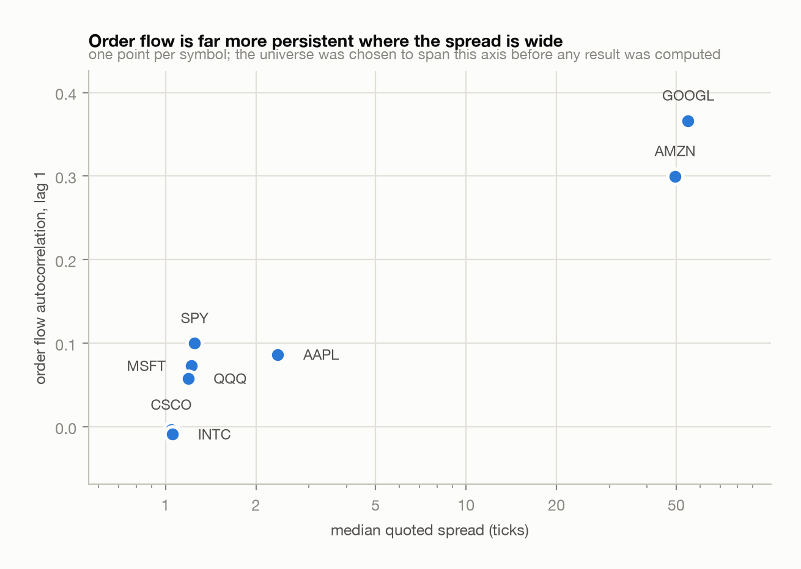
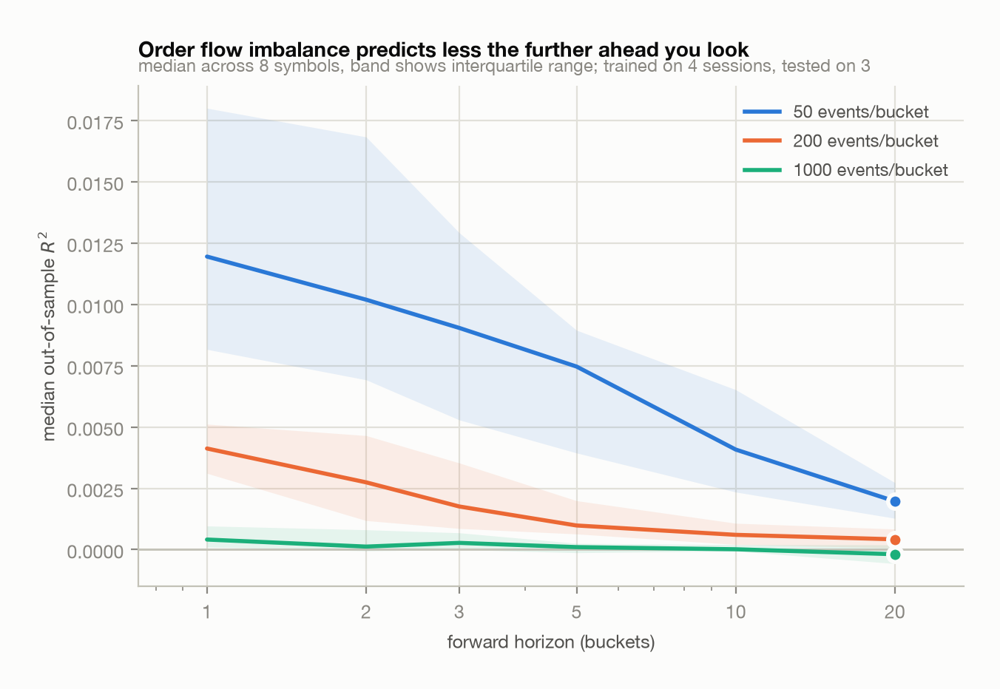
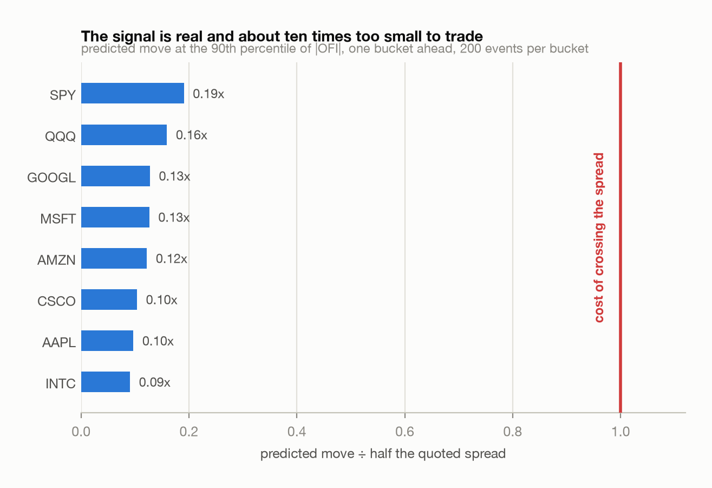
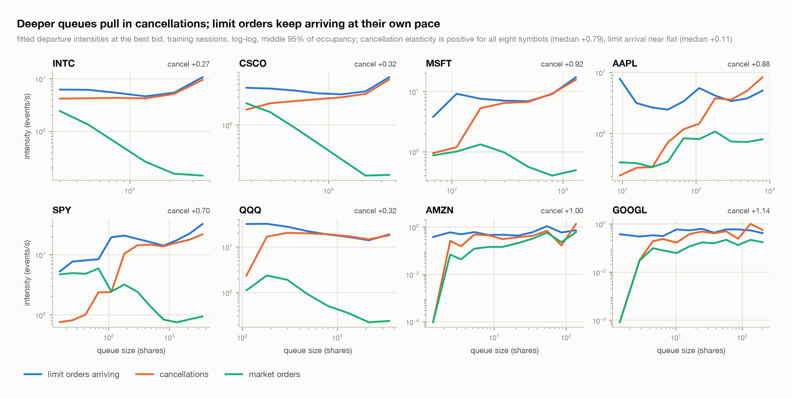

# microstructure

Limit order book reconstruction from raw Nasdaq ITCH 5.0, and a statistical
study of short-horizon predictability built on top of it.

Rust does the data path, Python does the statistics. The research plan, the
evaluation protocol, and the things this project deliberately refuses to do
are in [`DESIGN.md`](DESIGN.md).

## Status

| Phase | State |
|---|---|
| 0. Data fetch and skeleton | done |
| 1. ITCH 5.0 decoder | done |
| 2. Book reconstruction, validated | done |
| 3. Per-event export, validated | done |
| 3b. Study panel built | done |
| 3c. Feature construction, validated | done |
| 4. OFI predictability study | done |
| 5. Fitted queue-reactive model | done |
| 6. Writeup | drafted below |

The result is in **[Result](#result)** below. Everything before it is the
engineering the result rests on: a reconstruction that was checked rather than
assumed.

## Reconstruction result

Full Nasdaq session, 2019-07-30, all 8,849 symbols reconstructed
simultaneously. The BX session for the same date is shown alongside it.

```
                          Nasdaq          BX
messages             282,229,684   28,734,686
  add                125,460,750   10,629,593
  executed             7,717,995      681,693
  cancel               2,358,032      299,199
  delete             119,999,061   10,164,658
  replace             21,253,951    2,046,443
  hidden trade         1,461,010      243,778
  cross                   17,700            0

elapsed                  50.46 s       3.73 s
throughput          5.59 M msg/s  7.70 M msg/s

crossed-book checks  141,170,621   12,435,862
crossed-book fails             0            0
unknown order refs             0            0
oversized removals             0            0
duplicate order ids            0            0
level inconsistent             0            0
orders still live              0            0
depth vs order map    consistent   consistent
```

The four zeros are the point.

- **No crossed books.** Across 141 million checks during the continuous
  session, best bid never met or crossed best ask. Checked only between 09:30
  and 16:00, because a crossed book while halted or accumulating auction
  interest is legitimate and flagging it would be a false positive.
- **No unknown order references.** Every one of the 151 million executions,
  cancels, deletes, and replaces referred to an order the book already knew
  about. A non-zero count here means messages are being dropped or misrouted.
- **No oversized removals.** No message ever tried to take more shares off an
  order than it held.
- **No orders left live at end of day.** Every one of the 125.5 million orders
  opened during the session was accounted for and removed. This is the
  strongest of the four: it is a conservation law over the whole day, and
  almost any bookkeeping error would break it.

Separately, the level aggregates and the order map are maintained
independently and reconciled at the end: recomputing per-price depth from the
order map reproduces the incrementally maintained levels exactly.

Two reconstruction traps that these checks exist to catch, both handled:

- **Hidden trades (`P`) must not touch the visible book.** Those shares were
  never displayed. Applying them double-counts depth consumption and silently
  inflates every order-flow feature.
- **Execute-with-price (`C`) removes depth at the order's resting price**, not
  at the price that printed. Removing at the execution price corrupts a level
  the order was never on.

## Throughput

5.6 M messages/second single-threaded on the full Nasdaq feed, including gzip
decompression and maintaining 8,849 live books. A whole trading day replays in
50 seconds, which is the property that matters: re-running the entire study
after a bug fix is a coffee-length operation rather than an overnight job.

The decoder borrows from the read buffer and allocates nothing per message.
Prices stay as integer ticks of $0.0001 end to end; converting to floating
point happens once, in the analysis layer.

Routing is a direct index by the header's `stock_locate`. Every ITCH message
carries one, including the order messages that identify their order only by
id, so no order-id to book map is needed and no hashing happens per message.

Decompression is about a quarter of wall time (`gunzip` alone on the BX
session is 0.98 s against a 3.73 s replay), so a faster inflate backend is
worth perhaps 15%. Not currently a priority.

## Export

`--symbols X,Y --out-dir D` writes one gzipped CSV per symbol, one row per
book event, carrying the top of book both before and after. Rust writes
events; Python computes features. Feature definitions will change many times
during the study, and each change should cost a re-read of these files rather
than a re-parse of a multi-gigabyte session.

Exporting AAPL, MSFT, and SPY from the full Nasdaq session takes 24.6 s and
produces 4.37 M rows. `py/validate_export.py` then re-checks the artifact
rather than trusting it, including the crossed-book invariant, that a price
and its size agree about whether a side is empty, that an add at the touch
moves depth by exactly its own size, and that a replace decomposes into its
two legs.

That validator immediately caught a real modelling error: replaces were being
exported as plain `add` events. A replace is a cancellation plus a
resubmission that loses queue priority, so where both legs rest at the same
price its net depth effect is `new - old`, not `new`. Treating it as a
submission overstates incoming liquidity and hands a point-process model the
wrong mark. It now has its own label and carries the withdrawn leg.

## Verification of the panel

Three properties, checked rather than assumed, before any analysis rests on
this data.

**Every exported row is re-checked on the artifact.** 1,120 checks across the
56 files, all passing: timestamps monotone, coverage running from the opening
bell to the closing one, no crossed book, price and size agreeing about
whether a side is empty, and, on *both* sides independently, that adds move
the touch by their own size, cancels and trades remove their own size, and
replaces decompose into their two legs.

**Replay is deterministic.** Re-exporting a session reproduces all eight files
byte-for-byte, and the row counts match [`PANEL.md`](PANEL.md). The
reproducibility claim there is tested, not asserted.

**Two venues agree.** Every check above is internal: it asks whether a book
agrees with itself, and all of them would pass on a book that is
self-consistent but systematically wrong. Nasdaq and Nasdaq BX publish
independent streams for the same session, so reconstructing a symbol from each
gives two independent views of one price. BX prints land against the *Nasdaq*
mid about as tightly as Nasdaq's own prints land against it:

| | BX print vs Nasdaq mid | Nasdaq print vs Nasdaq mid |
|---|---|---|
| AAPL | 0.50c median, 3.50c p95, 97.6% within 5c | 0.50c, 3.00c, 98.1% |
| MSFT | 0.50c, 2.50c, 99.2% | 0.50c, 2.50c, 99.3% |
| INTC | 0.50c, 1.50c, 99.9% | 0.50c, 1.50c, 99.9% |

A half-cent median is half a one-cent spread, which is where a print resting
at the bid or ask should sit. The venues are crossed against each other in
0.006% of seconds, which is the transient arbitrage you would expect rather
than a standing one.

```sh
python3 py/cross_venue_check.py AAPL MSFT INTC
```

## Features

`py/features.py` builds order flow imbalance (Cont-Kukanov-Stoikov), queue
imbalance, aggressor sign, signed volume and effective spread from the event
log. `py/feature_spike.py` validates them **without computing any forward
return**, which is the point: once you have seen how a feature predicts, every
later choice about that feature is made by someone who has already looked. The
regression belongs in phase 4, on a construction that is already settled.

So the checks are internal properties: that OFI reduces exactly to the change
in depth when the touch does not move, that an add at the bid contributes
`+shares` and one at the ask `-shares`, that queue imbalance stays in
`[-1, 1]`, and that the effective spread is non-negative, which is the
arithmetic signature of a correct aggressor sign. 86.1 M rows across the 56
files, zero failures.

Per-event OFI is computed from a single row's own before-to-after transition
rather than by comparing consecutive rows. The two are identical, because each
row's `before` is the previous row's `after`, and that chaining is itself
checked.

The pre-registered tick-size stratification is visible in the features, on
2019-07-30:

| | price | spread | ticks | effective | OFI sd | bucketed OFI ac(1) |
|---|---|---|---|---|---|---|
| INTC | $51.98 | 1.0c | 1 | 1.0c | 231 | +0.012 |
| CSCO | $56.69 | 1.0c | 1 | 1.0c | 238 | +0.048 |
| MSFT | $140.62 | 1.0c | 1 | 1.0c | 99 | +0.093 |
| AAPL | $208.25 | 1.0c | 1 | 1.0c | 88 | +0.102 |
| SPY | $300.55 | 1.0c | 1 | 1.0c | 347 | +0.129 |
| QQQ | $193.78 | 1.0c | 1 | 1.0c | 353 | +0.141 |
| AMZN | $1897.94 | 35.0c | 35 | 24.0c | 32 | +0.295 |
| GOOGL | $1230.79 | 41.0c | 41 | 26.0c | 21 | +0.412 |

Spread in ticks spans 1 to 41, which is the range the universe was chosen to
cover. Effective spread falls below quoted only where the spread is wide
enough to permit price improvement, queue sizes fall as price rises, and order
flow is far more persistent in the small-tick names. A study drawn from one
stratum could not have told you any of that.

<picture>
  <source media="(prefers-color-scheme: dark)" srcset="figures/tick-regimes-dark.png">
  
</picture>

## Result

> Over the next `k` events, does order flow imbalance predict the change in
> mid-price, and does that predictability survive an honest accounting of
> transaction costs and multiple testing?

**Yes, no, and the second answer is the more robust one.** OFI predicts
short-horizon mid-price changes with a statistically solid but economically
negligible effect: at every bucket size, symbol and horizon examined, the
predicted move is smaller than the spread required to capture it.

The protocol was fixed in [`DESIGN.md`](DESIGN.md) before any coefficient was
computed, and feature construction was settled and unit-tested before the
first regression ran.

### The reproduction works

Contemporaneous price *impact* runs first, as a control. It is not a
prediction and cannot be traded, but it is a known result, so failing it would
mean the pipeline was broken and any subsequent null would be a bug rather
than a finding.

| | QQQ | SPY | CSCO | AAPL | MSFT | INTC | AMZN | GOOGL |
|---|---|---|---|---|---|---|---|---|
| R² | 0.63 | 0.53 | 0.52 | 0.50 | 0.49 | 0.49 | 0.37 | 0.17 |

Cont, Kukanov and Stoikov report roughly 0.65 on their sample. Six of eight
symbols land between 0.49 and 0.63. The two low outliers are exactly the two
very-small-tick names, where spreads span 35 to 41 ticks and the linear
depth-to-price relationship is the weakest description of the book.

### The prediction is real and tiny

<picture>
  <source media="(prefers-color-scheme: dark)" srcset="figures/ofi-decay-dark.png">
  
</picture>

Strictly forward windows, trained on the first four sessions and tested on the
last three, chronologically. Median out-of-sample R² across the eight symbols:

| horizon (buckets) | k=50 | k=200 | k=1000 |
|---|---|---|---|
| 1 | 0.0120 | 0.0041 | 0.0004 |
| 2 | 0.0102 | 0.0027 | 0.0001 |
| 3 | 0.0090 | 0.0018 | 0.0003 |
| 5 | 0.0075 | 0.0010 | 0.0001 |
| 10 | 0.0041 | 0.0006 | 0.0000 |
| 20 | 0.0020 | 0.0004 | -0.0002 |
| CIs excluding zero | 48/48 | 37/48 | 6/48 |

The decay is monotone in horizon at every bucket size, which is the shape the
effect should have if OFI carries information that the price absorbs quickly.

It is also strongly scale-dependent, and that is worth stating plainly rather
than burying: **the statistical significance is not robust to bucket size.** At
50 events per bucket every interval excludes zero; at 1000 events almost none
do. A study that had only run k=50 would have reported a much stronger result
than one that had only run k=1000, and neither would have been wrong about its
own specification. Reporting all three is the only honest option, and all 144
specifications are logged in `py/experiments.jsonl`.

### It is not tradeable

<picture>
  <source media="(prefers-color-scheme: dark)" srcset="figures/ofi-vs-cost-dark.png">
  
</picture>

Comparing the predicted move at the 90th percentile of |OFI| against half the
median quoted spread, which is the minimum cost of crossing:

| | SPY | QQQ | GOOGL | MSFT | AMZN | CSCO | AAPL | INTC |
|---|---|---|---|---|---|---|---|---|
| predicted / half-spread | 0.19 | 0.16 | 0.13 | 0.13 | 0.12 | 0.10 | 0.10 | 0.09 |

**Zero of 144 specifications produce a predicted move exceeding half the
spread.** The best case, SPY, reaches 19% of the cost of crossing. Under
Benjamini-Hochberg at 5%, 45 of 48 predictive hypotheses survive at k=200, so
this is not a failure to detect the signal. The signal is there, it is
detectable, and it is roughly an order of magnitude too small to pay for the
spread.

That gap between statistical and economic significance is the actual finding,
and it is the reason the cost comparison was written into the protocol before
any result existed rather than added afterwards.

### Limits

- **Single venue.** This is Nasdaq-book OFI predicting the Nasdaq mid, not a
  consolidated NBBO. A consolidated book from public data is its own project.
- **No queue position.** Two orders at the same price are interchangeable
  here, so nothing captures the value of being early in a queue.
- **Half the quoted spread is a floor on cost, not an estimate of it.** A real
  execution also faces queue risk, adverse selection, and fees. The true
  threshold is higher than the one used, which only strengthens the negative
  conclusion.
- **Seven sessions.** They span a year and include one day shortly before the
  February 2020 repricing, but each is a single day, and the test set is three.
- **Linear and univariate.** A single regressor with no interactions. The
  queue-reactive and Hawkes extensions in `DESIGN.md` are where a
  non-linear, state-dependent treatment belongs.

```sh
python3 py/build_buckets.py 200
python3 py/study_ofi.py --k 200
```

## The book is state-dependent

Phase 5 asks a different question from phase 4. Rather than predicting price,
it asks whether the queue at the best quote is a *homogeneous* process at all.

The queue is modelled as a continuous-time Markov chain leaving each state
through one of four channels: a limit order joining (L), a cancellation (C), a
market order consuming (M), or a price move replacing the queue (P). For a
Markov jump process the maximum-likelihood intensity is just departures over
time at risk, `N_k(q) / T(q)`, so a whole session reduces to two small tables.
Rates are shrunk towards their pooled value under a weak Gamma prior worth one
pseudo-event, because a raw `N/T` assigns exactly zero to any state where a
channel happened not to fire, which asserts impossibility and makes held-out
likelihood negatively infinite.

<picture>
  <source media="(prefers-color-scheme: dark)" srcset="figures/queue-intensities-dark.png">
  
</picture>

Measured as elasticities over the middle 95% of occupancy, `d log λ / d log q`:

| | INTC | CSCO | QQQ | SPY | AAPL | MSFT | AMZN | GOOGL | median |
|---|---|---|---|---|---|---|---|---|---|
| cancellations | +0.27 | +0.32 | +0.32 | +0.70 | +0.88 | +0.92 | +1.00 | +1.14 | **+0.79** |
| limit arrivals | +0.13 | +0.06 | −0.23 | +0.26 | +0.00 | +0.32 | +0.11 | +0.10 | **+0.11** |

**Cancellation intensity rises with queue size in all eight symbols; limit
arrival is near flat.** That is the Huang-Lehalle-Rosenbaum finding, reproduced,
and it is the mechanism that makes a deep queue mean-revert rather than drift:
depth attracts cancellation, not more depth.

An elasticity of exactly 1 would mean a constant per-share cancellation hazard,
each resting order equally likely to be pulled regardless of how many others
sit beside it. The median of +0.79 says larger queues are cancelled somewhat
*less* aggressively per share, and the two large-tick names, at +0.27 and
+0.32, markedly so. Being early in a long queue at a one-cent-spread stock is a
more durable position than the raw depth suggests.

### Does the state dependence earn its parameters?

Against a homogeneous Poisson null with the same four channels and constant
rates, both fit on the training sessions and judged on the held-out ones.

| | queue-reactive | Poisson null |
|---|---|---|
| held-out log-likelihood, wins | **15 of 16** symbol-sides | 1 of 16 |
| median gain | **+0.069 nats/event** | |
| total gain | **+1,020,540 nats** over 16.3 M held-out events | |
| free intensities | 92 per symbol-side | 4 |
| simulated occupancy, closer | **14 of 16** | 2 of 16 |
| median total variation | **0.196** | 0.249 |

Held-out likelihood is the sharp test: it involves no simulation and no choice
of summary statistic, and 88 extra parameters buying over a million nats is not
a close call. CSCO's ask side is the one loss, at −0.029 nats/event.

The generative test is deliberately harder and the margin is smaller. Neither
model was fit to the stationary occupancy distribution — estimation used
holding times and departure counts state by state — and both simulations draw
from the *same* empirical event-size and restart distributions, so the Poisson
null inherits a great deal of realistic structure. It is a strong baseline
rather than a straw man, which is why it closes to within 0.05 total variation
even while being decisively rejected on likelihood.

```sh
python3 py/build_queue_states.py
python3 py/study_queue_reactive.py
python3 py/figures.py          # regenerates every figure, light and dark
```

## Failing loudly

The reader treats an unknown message type, or a length prefix disagreeing with
the specification, as fatal. Both mean the stream position is wrong, so
everything decoded after that point would be plausible-looking garbage.

The alternative, skipping unrecognised messages, is worse than useless here: a
book built from a desynchronised stream still looks like a book. It has a bid,
an ask, and a spread; it is simply wrong, and nothing downstream would notice.
Refusing to guess is what makes the invariant results above mean anything.

## Layout

```
crates/itch      ITCH 5.0 decoder and streaming reader
crates/lob       order book state machine, and BookSet session routing
crates/export    per-event rows to gzipped CSV, one file per symbol
crates/replay    binary: drives a session, verifies, exports, reports
scripts/fetch.sh downloads a session from Nasdaq
py/              analysis; currently the export validator
data/            gitignored; fetched, never committed
```

## Running it

```sh
cargo build --release
cargo test --release          # 46 tests
pip install -r requirements.txt
python3 -m pytest py/ -q      # 44 tests

./scripts/fetch.sh list                 # what Nasdaq publishes
./scripts/fetch.sh bx 20190730          # 391 MB, good for development
./scripts/fetch.sh nasdaq 20190730      # 3.7 GB, the real thing

./target/release/replay data/raw/20190730.BX_ITCH_50.gz
./target/release/replay data/raw/20190730.BX_ITCH_50.gz --symbols AAPL,MSFT

# export per-event rows, then check the artifact rather than trusting it
./target/release/replay data/raw/20190730.NASDAQ_ITCH50.gz \
    --symbols AAPL,MSFT,SPY --out-dir data/events --session-only
python3 py/validate_export.py data/events/*.csv.gz
```

`--reconcile-every N` runs the full depth-versus-order-map reconciliation
every N messages instead of only at the end. Slow, but it turns a silent
divergence into an immediate assertion at the message that caused it.

## Data

Nasdaq publishes historical ITCH 5.0 sample days openly at
<https://emi.nasdaq.com/ITCH/>, no account required: seven dates across 2019
and January 2020 for both Nasdaq and Nasdaq BX.

Seven distinct days matters for the study. Out-of-sample will mean a
different day, not a later slice of the same one; intraday autocorrelation
and a shared regime make same-day holdout optimistic by construction.

The panel is built:

```sh
./scripts/build_dataset.sh    # fetch, export and validate all seven sessions
```

Seven sessions across eight symbols, 86.1 M events, about 1.4 GB exported.
Per-symbol-day row counts are in [`PANEL.md`](PANEL.md); replay is
deterministic, so a correct rebuild reproduces them exactly. The universe and
the reason each symbol is in it are in [`DESIGN.md`](DESIGN.md), fixed before
any predictive result was computed.
